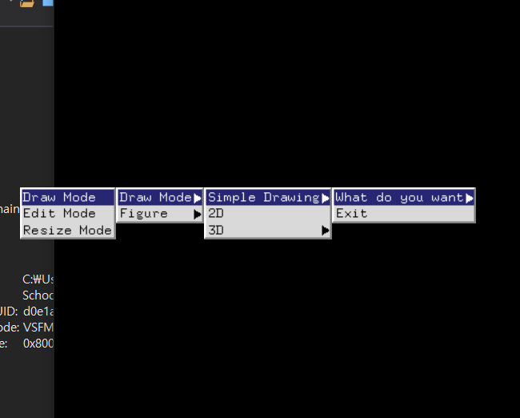
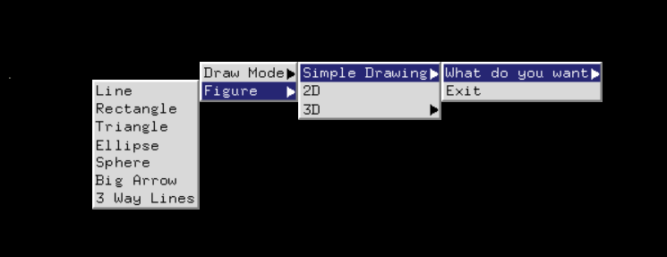
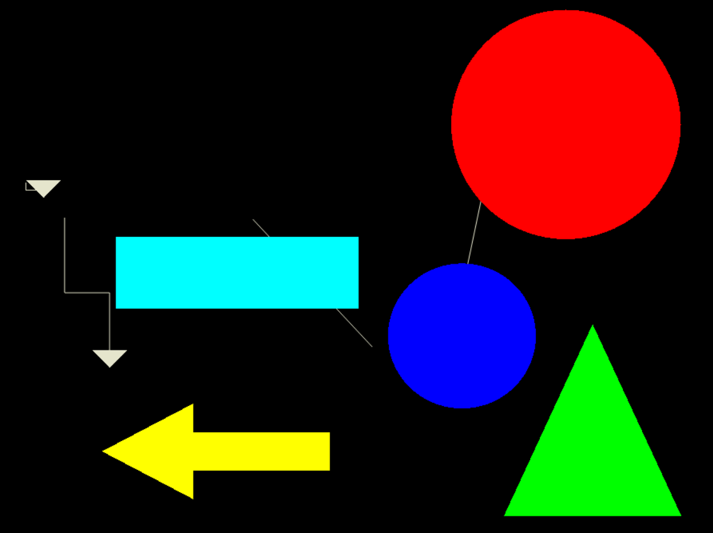
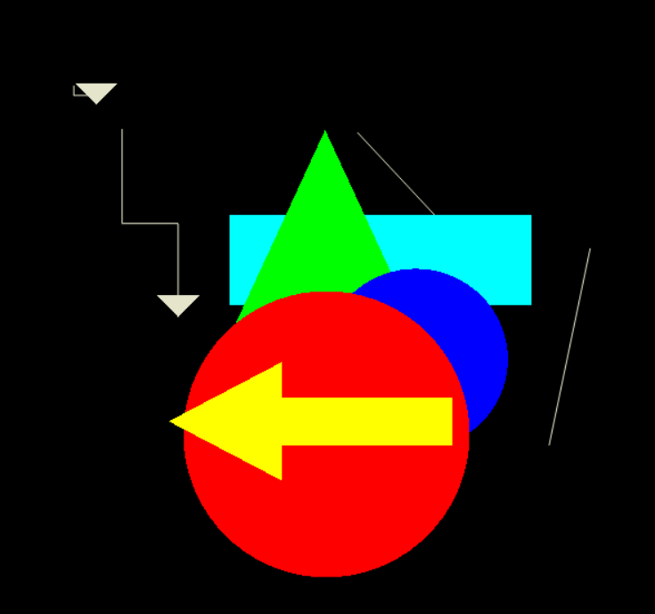
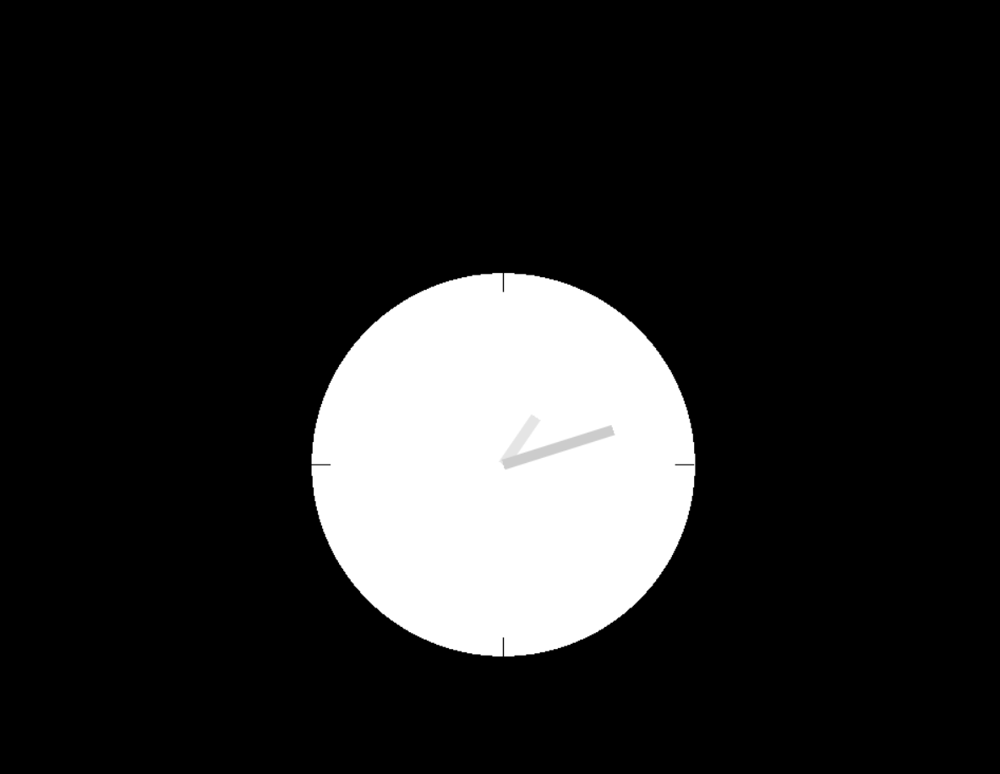
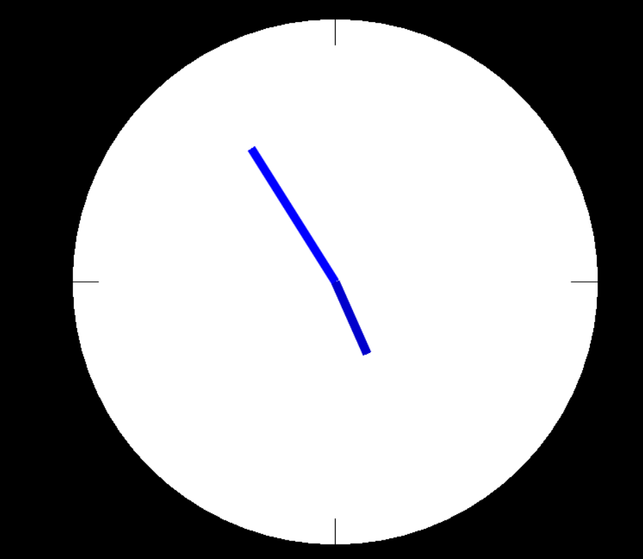
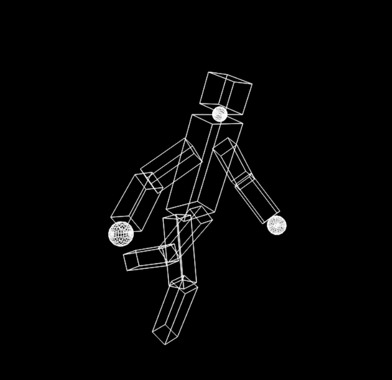
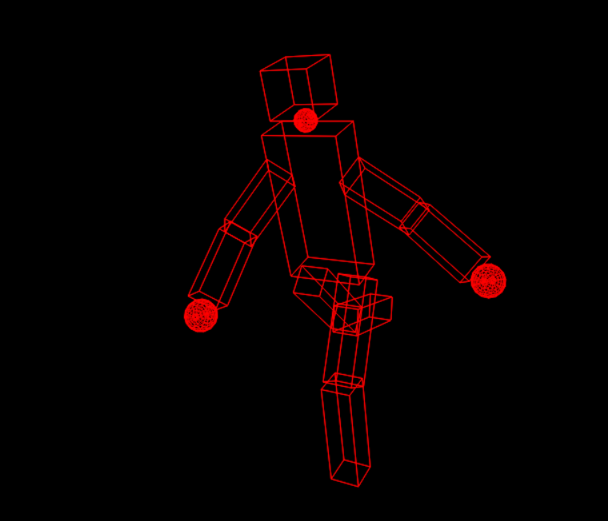
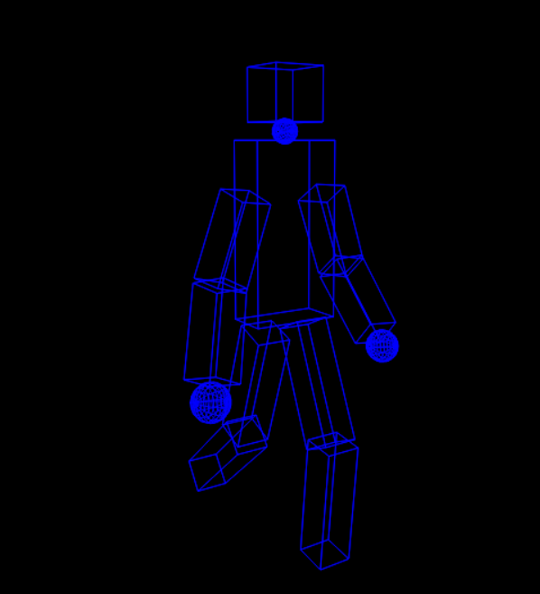
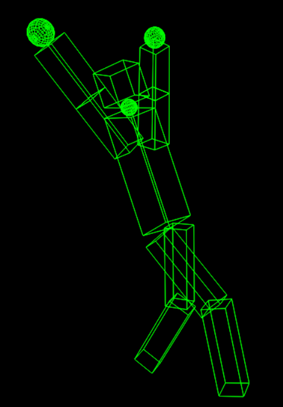

# OpenGL Simple Drawing App

## 1. Description
2d, 3d drawing application using openGL personal project 

with the menu call back below, you can select
which version of drawing you want to select 




<br/>

___ 


## 1_1) simple drawing app


### a. with keyboard(1,2,3,4,5,6,7) you can also choose figure

<br/>



### b. with keyboard('r','b','y','g' ...) you can select color



<br/>

### c. you can choose figure, and drag the position , also top figure will be chosen 

<br/>
<br/>

___ 


## 1_2) 2d clock 





### a. with keyboard('i','o') you can zoomin, zoom out
### b. with keyboard('q') you can stop the animation of clock 
### c. with keyboard('r','g' ...) you can change the color 

<br/>
<br/>

___ 


## 1_3) 3d robot 



### a. camera is rotating around the 3d robot 



<br/>

### b. with keyboard 'r,c,...' you can change the color of robot 

<br/>



### c. you can choose 3 version (run,walk,chase)



### d. with key board 'f,s' you can fasten,slow the speed of robot movement

<br/>
<br/>

___ 


## Development setup

```sh
download the code, 
use the visual studio
run the application in rootDir/연습
```

## Development Period
2021.05.20 ~ 2021.05.25