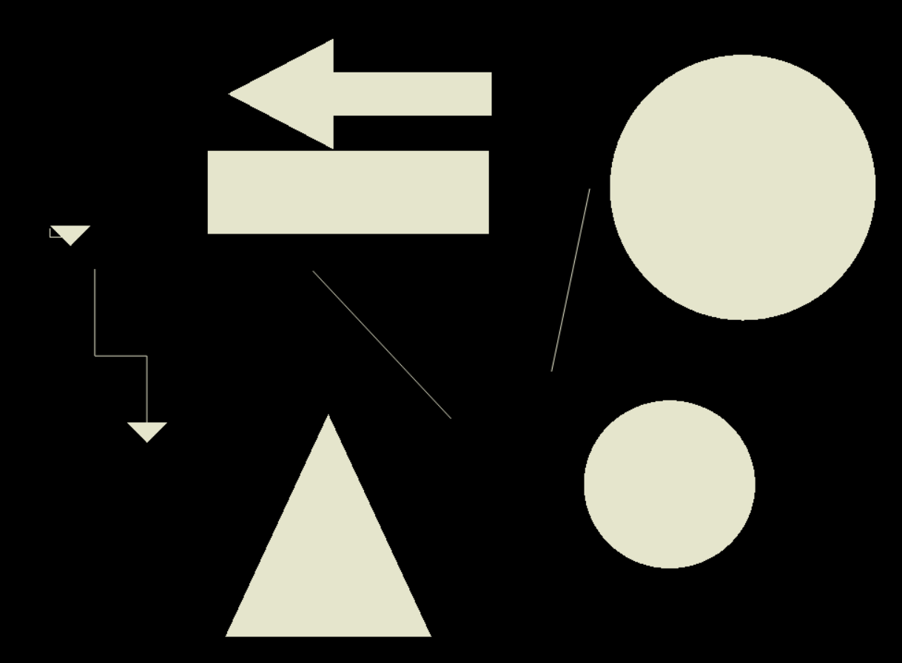

# OpenGL Simple Drawing App
# a. beforeFinal

## 1. Description
2d, 3d drawing application using openGL personal project 

with the menu call back below, you can select
which version of drawing you want to select 


<br/>

___ 


## 1) simple drawing app


### a. with keyboard(1,2,3,4,5,6,7) you can also choose figure

<br/>


### b. with keyboard('r','b','y','g' ...) you can select color


<br/>

### c. you can choose figure, and drag the position , also top figure will be chosen 

<br/>
<br/>

___ 


## 2) 2d clock 


### a. with keyboard('i','o') you can zoomin, zoom out
### b. with keyboard('q') you can stop the animation of clock 
### c. with keyboard('r','g' ...) you can change the color 

<br/>
<br/>

___ 


## 3) 3d robot 


### a. camera is rotating around the 3d robot 


<br/>

### b. with keyboard 'r,c,...' you can change the color of robot 

<br/>


### c. you can choose 3 version (run,walk,chase)


### d. with key board 'f,s' you can fasten,slow the speed of robot movement

<br/>
<br/>

___ 


## Development setup

```sh
download the code, 
use the visual studio
run the application in rootDir/beforeFinal/연습
```

---
# b. afterFinal

## 1. Description
2d, 3d drawing application using openGL personal project 

Projects mainly used with Nested Transformation

<br>
<br>

## 1) 2d viking 

<br/>


<br/>
<br/>

___ 

<br/>

## 2) 2d ferris Wheel

<br/>


### with rotate animation 

<br/>
<br/>

___ 

<br/>

## 3) 2d Time Changing Background  

<br/>


### Sun above rotates and, background color changed

### Leaf Falls down with animations 
___ 

<br/>

## 4) 3d Clouds,Robots Moving Background  

<br/>


### Clouds Above Rotating, generated in random positions

### Robots Moving Around, generated in random positions

### Applying Basic Light Therory

<br/>
<br/>

___ 


## Development setup

### 1) beforeFinal
```sh
download the code, 
use the visual studio
run the application in rootDir/beforeFinal/연습
```
## Development Period
2021.05.20 ~ 2021.05.25

---

### 2) afterFinal 
```sh
download the code, 
use the visual studio
run the application in rootDir/afterFinal/연습
```

## Development Period
2021.06.08 ~ 2021.06.11

